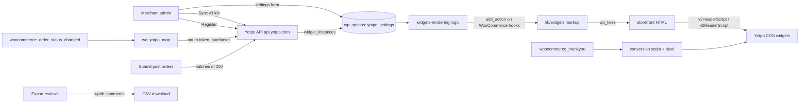
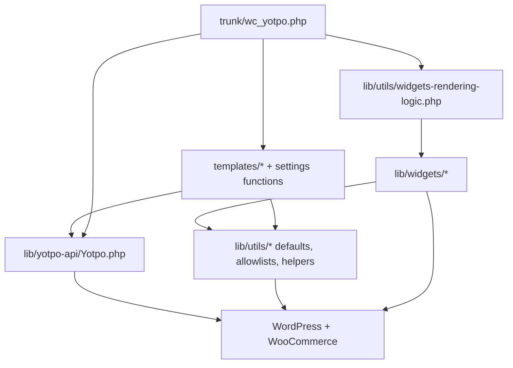

# Architecture

## System Overview
A WordPress plugin that runs inside a merchant's WooCommerce store. It has no server of its own. On the storefront it hooks placeholder `div`s into WooCommerce templates and loads Yotpo's JavaScript, which fills them in the shopper's browser. On the server side it talks to the Yotpo API for three things only: sending orders (mail after purchase), fetching the v3 widget instance ids, and registering a new Yotpo account from the settings page. All state is one WordPress option, `yotpo_settings`. The plugin is published on WordPress.org from a manual SVN copy of `trunk/` [1].

## Module Map
| Module | Responsibility | Key Files | Owner |
|--------|---------------|-----------|-------|
| Bootstrap | Plugin header, hook registration, activation/deactivation/uninstall, HPOS declaration | `trunk/wc_yotpo.php:1-62`, `trunk/uninstall.php` | Orbits |
| Widget rendering | Decide per page type (product, category/shop, home) and v2/v3 which widgets to hook, and where | `trunk/wc_yotpo.php:63-92`, `trunk/lib/utils/widgets-rendering-logic.php` | Orbits |
| Widget markup | HTML for each widget, v2 and v3 | `trunk/lib/widgets/*.php`, `trunk/wc_yotpo.php:112-250` | Orbits |
| Output allowlists | `wp_kses` allowlists for every echoed fragment | `trunk/lib/utils/allowed-html-functions.php` | Orbits |
| Orders to Yotpo | Send an order when it reaches the configured status; send the last 90 days on request | `trunk/wc_yotpo.php:292-496` | Orbits |
| Conversion tracking | Script + `noscript` pixel on the thank-you page | `trunk/wc_yotpo.php:497-515` | Orbits |
| Admin settings | Settings page, POST actions, widget-id sync, registration, debug log view | `trunk/templates/**`, `trunk/lib/utils/wc-yotpo-settings-functions.php`, `trunk/lib/utils/wc-yotpo-functions.php`, `trunk/assets/js/settings.js` | Orbits |
| Reviews export | Native WooCommerce reviews → CSV download | `trunk/classes/class-wc-yotpo-export-reviews.php` | Orbits |
| Yotpo API client | HTTP calls to `api.yotpo.com` through `wp_remote_request` | `trunk/lib/yotpo-api/Yotpo.php` | Orbits |
| Settings and helpers | Defaults, `yotpo_get_arr_value`, debug logger `ytdbg`, fatal-error page | `trunk/lib/utils/wc-yotpo-defaults.php`, `trunk/lib/utils/general-usage-functions.php`, `trunk/wc_yotpo.php:555-586` | Orbits |

## Data Flow

The plugin never stores Yotpo reviews. Product data goes to the browser as `data-*` attributes; Yotpo's scripts load the content.

## Key Abstractions
- One option, `yotpo_settings`, holds everything (credentials, widget version, v3 instance ids, per-page enable flags, order status, debug flag). Every read uses `wc_yotpo_get_default_settings()` as the fallback (`trunk/lib/utils/wc-yotpo-defaults.php:3`). Settings saved by an older version can lack newer keys, hence `yotpo_get_arr_value` (`trunk/lib/utils/general-usage-functions.php:3`).
- v2 vs v3: `use_v3_widgets()` = `widget_version === 'v3'` (`trunk/lib/utils/wc-yotpo-functions.php:3`). A v3 widget renders only when its instance id was synced (`trunk/wc_yotpo.php:125`, `:145`); v3 is the default since 1.7.9 (ADR-0002).
- Widget location: v3 `automatic` hooks widgets after the single product; `manual` hooks nothing, and the merchant calls the public `wc_yotpo_show_*` functions from the theme. v2 has `footer`, `tab` and `other` (`trunk/wc_yotpo.php:67-82`).
- Output: every fragment is built with `esc_attr()` and echoed through `wp_kses($html, yotpo_*_allowed_html())`, to pass WordPress.org Plugin Check (ADR-0003).

## Extension Points
- New v3 widget: an id key in `v3_widgets_ids` and enable flags in `v3_widgets_enables` (defaults file), the Yotpo `widget_type_name` mapping in `get_yotpo_widget_field_name()` (`trunk/lib/utils/wc-yotpo-settings-functions.php:3`), a `generate_v3_*` in `trunk/lib/widgets/`, a `wc_yotpo_show_*` in `trunk/wc_yotpo.php`, the hook in `widgets-rendering-logic.php`, the enabler in `trunk/templates/reusables/v3_enablers.php` / `widgets-settings.php`, and an allowlist if new attributes are printed.
- New setting: default + `wc_proccess_yotpo_settings()` + a field in `trunk/templates/wc-yotpo-settings.php`.
- New Yotpo endpoint: a method on `Yotpo` using `request()` (`trunk/lib/yotpo-api/Yotpo.php:26`).

## Boundaries
- Templates under `trunk/templates/` are admin-only; they are included only when `is_admin()` (`trunk/wc_yotpo.php:51`). Storefront code must not depend on them or on `Yotpo.php` being loaded (it is `require_once`d on demand in `wc_yotpo_map`).
- Storefront code must not call the Yotpo API: rendering is client-side.
- Nothing outside `trunk/` is shipped to merchants; plugin code and runtime assets live only in `trunk/`.

## Dependency Graph

**Forbidden imports:**
- `trunk/lib/widgets/*` must not include `templates/*` or `Yotpo.php`: they run on every storefront page.
- `trunk/lib/yotpo-api/Yotpo.php` must not read `yotpo_settings` itself; callers pass the app key and secret.

## Domain Ownership

| Domain | Owner | Models | Workers/Jobs | Key Invariants | Known Fragility |
|--------|-------|--------|--------------|----------------|-----------------|
| Storefront widgets | Orbits | `yotpo_settings` | none | Nothing renders without an app key (`trunk/wc_yotpo.php:56`); a v3 widget needs its instance id | Settings from old versions miss keys; direct `$settings['...']` reads raise warnings |
| Orders (MAP) | Orbits | WooCommerce orders (HPOS-compatible CRUD, `trunk/wc_yotpo.php:386`) | none; runs inside the status-change request | Only orders whose status equals `yotpo_order_status`; orders without a valid email or name are skipped | A slow or failing Yotpo call runs inside the merchant's order-status request (5 s timeout, `Yotpo.php:11`) |
| Admin settings | Orbits | `yotpo_settings`, `wc_yotpo_just_installed` | none | Only `manage_options` users (`trunk/templates/wc-yotpo-settings.php:9`) | Several POST actions do not verify the nonce (see troubleshooting) |

## Cross-Domain Flows

### Storefront render
**Trigger:** `template_redirect` on a non-admin request, when an app key is set.

**Execution Order:**
1. `wc_yotpo_init` enqueues `v3HeaderScript.js` or `v2HeaderScript.js` with `yotpo_settings` (app key, widget ids) localized (`trunk/wc_yotpo.php:205-221`).
2. `wc_yotpo_front_end_init` picks the page type: product → bottom line + footer widgets (v3 automatic) or footer/tab (v2); category/shop → `category_page_renders`; home → `rest_of_pages_renders`.
3. Each hooked `wc_yotpo_show_*` checks `get_reviews_allowed()` and its instance id, then echoes the markup through `wp_kses`.

**Failure Modes:**
- v3 selected but ids never synced → no widgets; fix with "Sync" on the settings page.
- A theme that does not fire the WooCommerce hooks → widgets missing; use the manual location and the public functions.

### Order submission (mail after purchase)
**Trigger:** `woocommerce_order_status_changed`.

**Execution Order:** `wc_yotpo_map` compares `'wc-' . status` with `yotpo_order_status`, builds the purchase (`wc_yotpo_get_single_map_data`), gets an OAuth token, and posts it with `create_purchase` (`trunk/wc_yotpo.php:292-321`).

**Failure Modes:** exceptions go to `error_log`; API errors are only visible with debug mode on (`ytdbg`). Orders with an email ending in a digit are skipped (`trunk/wc_yotpo.php:329`).

### Past orders
**Trigger:** "Submit past orders" on the settings page. Collects orders of the configured status from the last 90 days, in batches of 200, and hides the button after a full success (`trunk/wc_yotpo.php:365-496`).

### v3 widget-id sync
**Trigger:** "Sync" on the settings page, or saving the settings with v3 selected. `get_widget_instances()` calls `GET /api/v2/widgets` with an OAuth token and maps each `widget_type_name` to a settings key (`trunk/lib/utils/wc-yotpo-settings-functions.php:3-33`).

## Architectural Decisions
Index of ADRs (full records live in `docs/adr/`):

| ADR | Decision | Status |
|-----|----------|--------|
| [ADR-0001](docs/adr/0001-release-to-wordpress-org-by-manual-svn-copy-of-trunk.md) | Release to WordPress.org by a manual SVN copy of `trunk/`; GitHub is the source, not the distribution | Accepted |
| [ADR-0002](docs/adr/0002-v3-widgets-by-default-v2-kept-for-existing-installs.md) | v3 widgets are the default; v2 stays for existing installs | Accepted |
| [ADR-0003](docs/adr/0003-follow-wordpress-org-plugin-check.md) | Follow WordPress.org Plugin Check: `wp_kses` allowlists, `WP_Filesystem`, `wp_remote_*`, no hidden files in `trunk/` | Accepted |

## Constraints
- Performance: the render path runs on every storefront request; keep it to option reads. Order submission blocks the order-status request for up to the 5 s API timeout per call.
- Scalability: no background jobs; past orders are sent synchronously from the admin request.
- Compatibility: WordPress.org lists WordPress 3.5.1+, PHP 5.2+, WooCommerce 3.0+ (`trunk/readme.txt:49-55`); the code actually needs PHP 7.1+. The `yotpo_settings` keys, the public `wc_yotpo_show_*` functions and the widget CSS classes are used by merchants' sites and themes and must not change without a migration path. HPOS (custom order tables) compatibility is declared (`trunk/wc_yotpo.php:550-554`) [2].

# Citations

[1] Release procedure (`README.md:7-37`)
[2] HPOS support (git commits `fda2e94`, `7190794`, PR #52)
[3] Plugin Check fixes, `WP_Filesystem`, `wp_remote_*` (git commit `91dfc0b`, PR #73)
[4] v3 as default widget version (git commit `c337379`, PR #71)
